<div align="center">



<br/>


<br/>

<a href="https://kanhaiyachauhan037.github.io/">
  
</a>
<a href="https://www.linkedin.com/in/kanhaiya-chauhan-867794236/">
  
</a>
<a href="mailto:kanhaiyagkp037@gmail.com">
  
</a>
<a href="https://drive.google.com/file/d/19W_ve-MNUwEkv5ABa1n8YBR1Kk2fbiVj/view">
  
</a>

<br/><br/>


</div>

<br/>

## 🚀 About Me


I'm a **Software Engineer** who builds fast, scalable, production-ready products across web and mobile — from idea to deployment.

- 💼 Full-Stack & React Native Developer with hands-on experience shipping **live, user-facing apps** (cricket streaming & scoring platforms, live-event apps)
- ⚛️ Building with **React, React Native, Next.js & TypeScript**
- 🧠 Backend engineering with **Node.js, Express.js, NestJS & FastAPI**
- ☁️ Deploying and scaling on **AWS, Vercel & Docker**
- 🗄️ Comfortable across **PostgreSQL, MongoDB, MySQL & Redis**
- 📱 Shipping cross-platform **iOS & Android** apps from a single codebase
- 🔥 Currently deep-diving into **System Design & Performance Engineering**
- 🤝 Open to **full-time roles, freelance work & collaborations**

<br clear="right"/>

---

## 🛠️ Tech Stack

<div align="center">

**Frontend**
<br/>


<br/><br/>

**Mobile**
<br/>


<br/><br/>

**Backend**
<br/>


<br/><br/>

**Database**
<br/>


<br/><br/>

**Cloud & DevOps**
<br/>


<br/><br/>

**Tools**
<br/>


</div>

---

## 💻 Featured Projects

<table width="100%">
<tr>
<td width="50%" valign="top">

### 🏏 CricClubs
A cricket platform for **live scoring, matches, leagues, statistics and streaming**.

`React Native` `Next.js` `Node.js` `TypeScript` `AWS`

</td>
<td width="50%" valign="top">

### 🔥 Fire Set Go
A mobile platform for **live streaming, events and community experiences**.

`React Native` `Redux` `Agora` `APIs`

</td>
</tr>
<tr>
<td width="50%" valign="top">

### 🏆 Cricket League Platforms
Modern web portals for cricket leagues, tournaments and teams.

`Next.js` `React` `REST APIs` `TypeScript`

</td>
<td width="50%" valign="top">

### 🤖 Developer Automation
AI-powered workflows and tooling to boost developer productivity.

`Node.js` `Python` `APIs` `AI`

</td>
</tr>
</table>

> 💡 **Tip:** Pin your top 4–6 repos on GitHub (Profile → Customize your pins) so this section links straight to live code — recruiters click through pinned repos far more than a bio.

---

## 📊 GitHub Analytics

<div align="center">


<br/><br/>


</div>

---

## 🏆 GitHub Trophies

<div align="center">

</div>

---

## 🐍 Contribution Snake

<div align="center">

<!--START_SECTION:snake-->

<!--END_SECTION:snake-->

</div>

> ⚙️ **Setup required:** this snake animates your real contribution graph. Add the free [`Platane/snk`](https://github.com/Platane/snk) GitHub Action to your profile repo — it auto-generates the SVG above on a schedule. Takes ~2 minutes to set up and instantly makes the profile feel alive.

---

## 📚 Currently Learning

```text
Backend Engineering      ███████████████████░░  90%
System Design            ████████████████░░░░░  80%
AWS & Cloud               ███████████████░░░░░░  75%
Advanced TypeScript       █████████████████░░░░  85%
Performance Engineering   ██████████████░░░░░░░  70%
```

---

<div align="center">

## 💡 Developer Mindset

> **"Build it. Break it. Learn from it. Make it better."**

### ⚡ Code • Create • Learn • Repeat

</div>

---

## 🤝 Let's Connect

<div align="center">

<a href="https://kanhaiyachauhan037.github.io/">

</a>
<a href="https://www.linkedin.com/in/kanhaiya-chauhan-867794236/">

</a>
<a href="mailto:kanhaiyagkp037@gmail.com">

</a>
<a href="https://drive.google.com/file/d/19W_ve-MNUwEkv5ABa1n8YBR1Kk2fbiVj/view">

</a>

<br/><br/>


<br/><br/>


</div>
